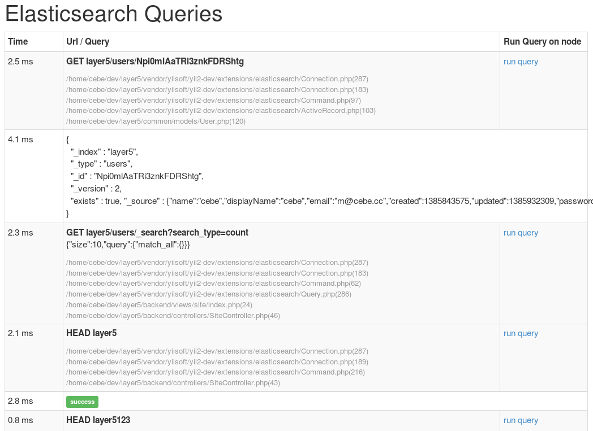

Использование Elasticsearch DebugPanel
----------------------------------

Расширение Yii2 Elasticsearch предоставляет `DebugPanel`, которая может быть интегрирована с модулем `yii debug`, и показывает выполненные запросы Elasticsearch. Оно также позволяет запускать эти запросы и просматривать результаты.

Добавьте следующий код в конфигурацию приложения, чтобы включить его(если у вас уже включен модуль отладки, достаточно просто добавить конфигурацию в секцию `panels`):

```php
    // ...
    'bootstrap' => ['debug'],
    'modules' => [
        'debug' => [
            'class' => 'yii\\debug\\Module',
            'panels' => [
                'elasticsearch' => [
                    'class' => 'yii\\elasticsearch\\DebugPanel',
                ],
            ],
        ],
    ],
    // ...
```


